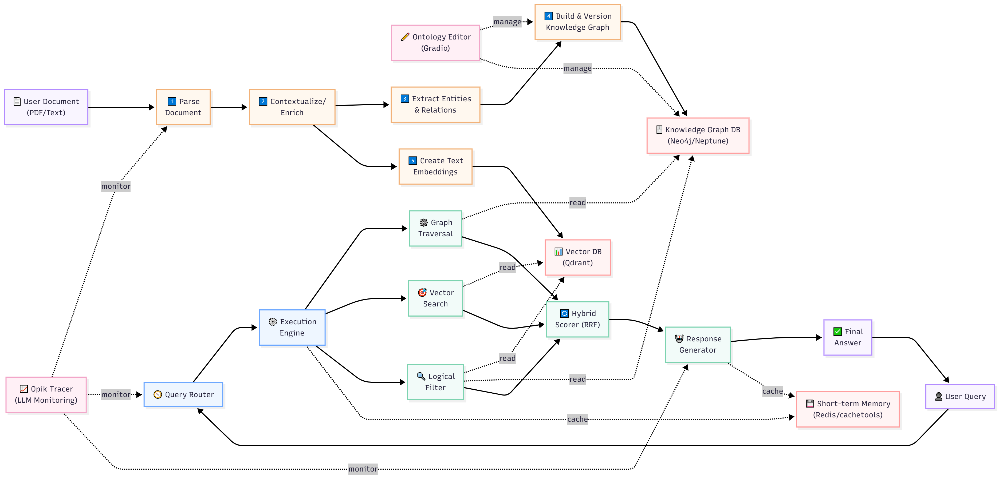

# 🚀 Agentic Graph RAG as a Service

This repository contains an extensible, production-grade platform that unifies knowledge from multiple sources into an intelligent retrieval system. It automatically constructs a knowledge graph from unstructured PDF documents and uses an agentic retrieval system to answer natural language queries.

---

## 🌟 Key Features

- **Automated Knowledge Graph Construction**: Transforms PDF documents into structured Neo4j knowledge graphs using LLM-powered ontology generation.
- **Agentic Retrieval System**: An advanced query router analyzes user intent to dynamically select the best retrieval strategy.
- **Multi-Modal Retrieval**: Combines three distinct retrieval methods for comprehensive answers:
  1.  **Graph Traversal**: For relationship-based and structural queries on Neo4j.
  2.  **Vector Search**: For semantic and contextual queries on Qdrant.
  3.  **Logical Filtering**: For queries with specific metadata constraints (e.g., dates, authors).
- **Hybrid Scoring**: Uses Reciprocal Rank Fusion (RRF) to intelligently merge and rerank results from all retrieval sources.
- **Pluggable Architecture**: Easily extend or swap out components like databases and embedding models thanks to a modular, interface-driven design.
- **Live UI**: A Gradio-based user interface for processing documents, asking questions, and visualizing the generated knowledge graph.

---

## 🏗️ Architecture

The system is designed with a modular, multi-layer architecture that separates concerns from data ingestion to user interaction.



## 🛠️ Technology Stack & Tooling Rationale

This section details the tools used in each step of the pipeline, explaining why they were chosen over alternatives.

### Step 1: Document Parsing

- **Tool Used**: **LlamaParse**
- **About**: An API service from LlamaIndex that uses LLMs to parse complex documents, including text, tables, and images.
- **Why Chosen**: It simplifies the ingestion pipeline immensely. Instead of building a complex, multi-stage process with separate tools for text extraction, table detection, and OCR, LlamaParse handles it all in a single, robust API call. This is far more effective for production-grade document processing.
- **Alternatives**: `PyMuPDF`, `PDFMiner`, `Unstructured.io`.

### Step 2: Contextual Enrichment & Answer Synthesis

- **Tool Used**: **Cohere (Command R+ Model)**
- **About**: A powerful large language model focused on enterprise use cases, with strong capabilities in summarization and following complex instructions.
- **Why Chosen**: It is used for two key tasks: generating contextual summaries for each text chunk to improve retrieval, and synthesizing the final, high-quality answer from the fused context provided by the retrieval tools. Its reliability in instruction-following makes it ideal for these structured tasks.
- **Alternatives**: `OpenAI GPT-4`, `Anthropic Claude 3`.

### Step 3: Agentic Routing & Planning

- **Tool Used**: **Groq (Llama 3 70b)**
- **About**: A service that runs open-source LLMs on custom LPU™ Inference Engine hardware, delivering extremely high performance (tokens/second).
- **Why Chosen**: **Speed**. The core of an agentic system is its ability to reason and make decisions quickly. Groq's sub-second latency allows the `AdvancedQueryRouter` to analyze user intent, create a retrieval plan, and orchestrate tools in real-time, providing a seamless user experience that would be impossible with slower models.
- **Alternatives**: `OpenAI GPT-3.5-Turbo`, local models (e.g., `Llama-3-8B`).

### Step 4: Embedding Model

- **Tool Used**: **Cohere (`embed-english-v3.0`)**
- **About**: A high-performance sentence-embedding model designed for semantic search and retrieval tasks.
- **Why Chosen**: It provides top-tier performance for retrieval tasks and integrates seamlessly with Cohere's other models. The architecture is designed to be pluggable, so this could easily be swapped for another provider via the `EMBEDDING_PROVIDER` setting.
- **Alternatives**: `OpenAI text-embedding-ada-002`, `Nomic Embed`.

### Step 5: Graph Database

- **Tool Used**: **Neo4j**
- **About**: The most popular and mature graph database, using the Cypher query language.
- **Why Chosen**: Its rich ecosystem, strong community support, and declarative Cypher language make it an excellent choice for storing and querying the knowledge graph. The system is built with a `GraphDatabaseAdapter` interface, so other graph databases can be easily added.
- **Alternatives**: `AWS Neptune` (a commented-out adapter is included), `ArangoDB`, `JanusGraph`.

### Step 6: Vector Database

- **Tool Used**: **Qdrant**
- **About**: A high-performance, open-source vector database built for production-level similarity search.
- **Why Chosen**: It is fast, scalable, and crucially, supports the advanced metadata filtering required by our **Logical Filtering** retrieval tool. The system uses an in-memory instance for easy setup, but can be configured to use a production server via the `.env` file.
- **Alternatives**: `ChromaDB`, `Pinecone`, `Weaviate`.

### Step 7: Short-Term Memory

- **Tool Used**: **Redis**
- **About**: An industry-standard in-memory data store.
- **Why Chosen**: It provides the microsecond latency needed to store and retrieve conversation history and session context, which is essential for a stateful, agentic system. `Cachetools` is used as a simple in-memory fallback if Redis is unavailable.
- **Alternatives**: `Memcached`, other in-memory key-value stores.

### Step 8: User Interface & Visualization

- **Tool Used**: **Gradio**
- **About**: A Python library for creating simple, fast web UIs for machine learning models.
- **Why Chosen**: It allows for the rapid development of a functional user interface directly in Python, which is perfect for building the visual ontology editor, graph visualization, and processing dashboards without requiring a separate frontend framework.
- **Alternatives**: `Streamlit`, `Dash`, a custom `React`/`Vue.js` frontend.

---

## ⚙️ Configuration

The application is configured through environment variables, which are loaded from a `.env` file. You can copy the `.env.example` file to `.env` and fill in your API keys and other settings.

Here are the most important settings:

*   `EMBEDDING_PROVIDER`: The embedding provider to use. Defaults to "cohere".
*   `QDRANT_VECTOR_SIZE`: The vector size for the Qdrant vector store. Defaults to 1024 for Cohere embeddings.
*   `COHERE_API_KEY`: Your Cohere API key.
*   `GROQ_API_KEY`: Your Groq API key.
*   `NEO4J_URI`: The URI for your Neo4j database.
*   `NEO4J_USER`: The username for your Neo4j database.
*   `NEO4J_PASSWORD`: The password for your Neo4j database.

---

## 💻 Development

This section describes the changes made to the application and the tools used to make them.

### Changes Made

*   **Configured Cohere Embeddings:** The application has been configured to use Cohere embeddings by default. The `EMBEDDING_PROVIDER` in `lyzr_challenge/config/settings.py` has been set to "cohere", and the `QDRANT_VECTOR_SIZE` has been set to 1024.
*   **Fixed Bugs:** Several bugs have been fixed, including a `ValueError` when applying suggestions, a `SyntaxError` in the Gradio UI, and an `IndentationError` in the Gradio UI.
*   **Added Download Graph Feature:** A "Download Graph" button has been added to the Gradio UI, which allows users to download the current ontology as a JSON file.
*   **Added Versioning Feature:** A versioning system has been added to the ontology editor, allowing users to switch between different versions of the ontology.

### Tools Used

*   **`default_api.read_file`:** This tool was used to read the contents of files.
*   **`default_api.replace`:** This tool was used to modify the contents of files.
*   **`default_api.run_shell_command`:** This tool was used to run shell commands, such as deleting `__pycache__` directories and running the application.
*   **`default_api.search_file_content`:** This tool was used to search for strings in files.

---

## 📊 Observability

The application includes several features for observability, including logging, monitoring, evaluation, and data validation.

### Logging

The application uses the Python `logging` module to log events at different levels (INFO, WARNING, ERROR). The log configuration is centralized in `lyzr_challenge/config/settings.py`.

### Monitoring

The application uses `opik_tracer` to trace LLM calls, which provides a basic level of monitoring.

### Evaluation Metrics

The `lyzr_challenge/evaluation/evaluation_service.py` file defines a service for evaluating the performance of the RAG system. It tracks metrics like query length, answer length, routing confidence, and overall score.

### Data Validation

The `lyzr_challenge/knowledge_graph/graph_builder.py` file includes the `validate_graph_structure` method, which validates the structure of the knowledge graph before it's used.

---

## 🚀 Usage

There are two ways to run the application:

### 1. Gradio Web Interface (Recommended)

This command starts the full web UI where you can upload a PDF, monitor its processing, ask questions, and interact with the ontology editor.

```bash
python main.py --gradio
```

### 2. Command-Line Interface

This command will run the full data processing pipeline on the PDF specified in your `.env` file and then drop you into an interactive query loop in your terminal.

```bash
python main.py
```

To run only the query interface (assuming a PDF has already been processed):

```bash
python main.py --query-only
```


```
python main.py --query-only
```


## 🚀 Next Steps

*   **Add support for more data sources:** The system currently supports PDF documents. It could be extended to handle other file types, such as Word documents, Powerpoint presentations, and web pages.
*   **Improve the ontology editor:** The ontology editor could be enhanced with more advanced features, such as a graphical interface for editing the ontology, a more powerful query language for exploring the graph, and a more sophisticated versioning system.
*   **Enhance the evaluation framework:** The evaluation framework could be extended to include more metrics, such as user feedback, and to support more complex evaluation scenarios, such as multi-turn conversations.
*   **Deploy the application to a cloud environment:** The application could be deployed to a cloud environment, such as AWS, Google Cloud, or Azure, to make it more scalable and accessible.


